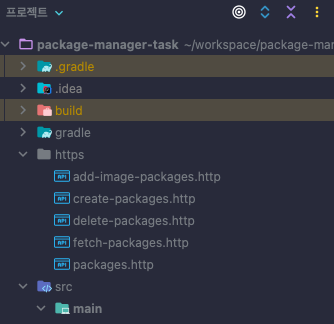

## package 관리를 위한 프로젝트입니다.

- [api-document.yaml](api-document.yaml) 파일을 참조해 구현된 api를 확인할 수 있습니다
- JDK 17을 기준으로 작성되어있습니다.
- `src/resources/data.sql`을 통해 초기 데이터가 주입됩니다.
- `test` 패키지를 참조해 테스트 코드를 확인할 수 있습니다.

## How to Run

- JDK 17을 설정해주세요.
- Gradle build를 수행합니다.

```shell
$ ./gradlew clean build run
```

- bootRun을 사용하여 실행할 수 있습니다.

```shell
$ ./gradlew bootRun
```

- 편의에 따라 IDE 실행 환경에서 실행하셔도 됩니다.


----
---

## HTTP Client

- HTTP Client를 통해 API 요청을 수행할 수 있습니다.
- [HTTP Client 공식 문서](https://www.jetbrains.com/help/idea/http-client-in-product-code-editor.html)
- [사용 방법 참조 문서](https://jojoldu.tistory.com/266)

- 
